# AYUSH-FHIR Terminology Microservice

A comprehensive FHIR R4-compliant terminology microservice bridging traditional Indian medicine systems (NAMASTE: Ayurveda, Siddha, Unani) with modern international standards (WHO ICD-11).

[](https://www.hl7.org/fhir/)
[](https://www.iso.org/standard/62653.html)
[](LICENSE)

---

## 📊 System Overview


---

## 🎯 Key Features

- **7,328 NAMASTE Codes** - Ayurveda (2,888) | Siddha (1,921) | Unani (2,519)
- **688 Concept Mappings** - NAMASTE ↔ WHO ICD-11 with 95% average confidence
- **FHIR R4 Compliant** - CodeSystem, ConceptMap, Condition resources
- **Dual Coding** - Traditional + International standards in EMR
- **3D Visualization** - Molecular-style mapping visualization
- **Audit Trail** - ISO 22600 compliant logging with PDF export
- **Real-time Search** - Diacritical mark normalization for Sanskrit/Tamil/Urdu

---

## 🏗️ Architecture

```mermaid
flowchart TB
    User((Clinician)) --> Frontend
    
    subgraph Frontend["Frontend (React + Vite)"]
        direction TB
        Dashboard["📊 Dashboard<br/><small>Stats & Activity</small>"]
        Search["🔍 Diagnosis Search<br/><small>NAMASTE → ICD-11</small>"]
        Viz3D["🎨 3D Mapping<br/><small>Molecular View</small>"]
        EMR["📝 EMR Update<br/><small>3-Step Workflow</small>"]
        Browse["📋 Browse Mappings<br/><small>Paginated Table</small>"]
    end
    
    Frontend <--> Backend
    
    subgraph Backend["Backend (Node.js + Express)"]
        direction TB
        Auth["🔐 Authentication<br/><small>JWT + ABHA</small>"]
        FHIR["🏥 FHIR R4 API<br/><small>/fhir/*</small>"]
        REST["🌐 REST API<br/><small>/api/*</small>"]
        Audit["📜 Audit Middleware<br/><small>ISO 22600</small>"]
    end
    
    Backend <--> Database
    
    subgraph Database["Database (PostgreSQL)"]
        direction TB
        Tables["8 Tables<br/><small>NAMASTE, ICD-11, Mappings,<br/>Patients, Treatments, Audit</small>"]
    end
    
    style Frontend fill:#667eea,stroke:#764ba2,stroke-width:3px,color:#fff
    style Backend fill:#f093fb,stroke:#f5576c,stroke-width:3px,color:#fff
    style Database fill:#4facfe,stroke:#00f2fe,stroke-width:3px,color:#fff
```



---

## 🔄 EMR Workflow

The system provides a streamlined 3-step workflow for creating dual-coded treatment records:

```mermaid
flowchart LR
    Start([👨‍⚕️ Doctor<br/>Login]) --> Step1
    
    subgraph Step1["1️⃣ Select Patient"]
        direction TB
        S1A["Search by<br/>ABHA ID or Name"]
        S1B["View Results"]
        S1C["Select Patient"]
        S1A --> S1B --> S1C
    end
    
    Step1 --> Step2
    
    subgraph Step2["2️⃣ Select Diagnosis"]
        direction TB
        S2A["Search NAMASTE<br/>e.g., vikara"]
        S2B["View Codes +<br/>Mapping Counts"]
        S2C["Expand to See<br/>ICD-11 Mappings"]
        S2D["Select Mapping<br/>with Confidence"]
        S2A --> S2B --> S2C --> S2D
    end
    
    Step2 --> Step3
    
    subgraph Step3["3️⃣ Notes & Consent"]
        direction TB
        S3A["Enter Clinical<br/>Notes"]
        S3B["Check Patient<br/>Consent"]
        S3C["Review Summary"]
        S3D["Create Record"]
        S3A --> S3B --> S3C --> S3D
    end
    
    Step3 --> Success
    
    subgraph Success["✅ Success"]
        direction TB
        SC1["Save to DB"]
        SC2["Create Audit Log"]
        SC3["Generate FHIR<br/>Resource"]
        SC4["Redirect to<br/>Dashboard"]
        SC1 --> SC2 --> SC3 --> SC4
    end
    
    Success --> End([✨ Complete])
    
    style Step1 fill:#667eea,stroke:#764ba2,stroke-width:3px,color:#fff
    style Step2 fill:#f093fb,stroke:#f5576c,stroke-width:3px,color:#fff
    style Step3 fill:#4facfe,stroke:#00f2fe,stroke-width:3px,color:#fff
    style Success fill:#43e97b,stroke:#38f9d7,stroke-width:3px,color:#fff
```



---

## 📁 Database Schema


---

## 🚀 Quick Start

### Prerequisites
- Node.js 18+
- PostgreSQL 14+
- Python 3.8+ (for data processing)

### Installation

```bash
# 1. Clone repository
git clone <repository-url>
cd ayush-fhir

# 2. Install backend dependencies
cd backend
npm install

# 3. Install frontend dependencies
cd ../frontend
npm install

# 4. Setup database
cd ../backend
cp .env.example .env
# Edit .env with your database credentials
node database/setup.js
node database/seed.js

# 5. (Optional) Process data
cd ../data-processor
pip install -r requirements.txt
python run_all.py
```

### Running the Application

```bash
# Terminal 1 - Backend
cd backend
npm run dev
# Server runs on http://localhost:5000

# Terminal 2 - Frontend
cd frontend
npm run dev
# App runs on http://localhost:5173
```

### Demo Login
- **ABHA ID:** `ABHA-DR-001`
- **Password:** `demo123`

---

## 🔌 API Endpoints

### FHIR R4 Endpoints


### REST API Endpoints

| Endpoint | Method | Description |
|----------|--------|-------------|
| `/auth/login` | POST | User authentication |
| `/api/stats` | GET | System statistics |
| `/api/search/diagnosis` | GET | Search with mappings |
| `/api/mappings` | GET | Browse all mappings |
| `/api/patients/search` | GET | Patient search |
| `/api/audit/recent` | GET | Recent audit logs |
| `/api/audit/export` | GET | Export audit logs |

---

## 📊 Data Processing Pipeline


**Run all steps:**
```bash
cd data-processor
python run_all.py
```

---

## 🎨 Frontend Features

### 1. Dashboard
- Real-time statistics (codes, mappings, accuracy)
- Recent activity feed with color-coded actions
- PDF audit log export

### 2. Diagnosis Search
- Real-time search with diacritical normalization
- Expandable cards showing all WHO/ICD-11 mappings
- Confidence scores and system filtering

### 3. 3D Mapping Visualization
- Molecular-style nodes using React Three Fiber
- Color-coded by system type
- Interactive: hover for labels, click for details
- No auto-rotation (user-controlled)

### 4. EMR Update
- 3-step workflow: Patient → Diagnosis → Notes
- Dual coding (NAMASTE + ICD-11)
- Auto-selects best mapping
- Consent management

### 5. Browse Mappings
- Paginated table (50 per page)
- System filtering
- CSV export
- Confidence score display

---

## 🔒 Security & Compliance

### Authentication Flow


### Audit Trail (ISO 22600)
- Automatic logging of all actions
- User ID, action type, resource, timestamp
- IP address and user agent tracking
- Exportable to PDF
- Immutable records

---

## 📈 Performance Metrics

| Metric | Value |
|--------|-------|
| NAMASTE Codes | 7,328 |
| ICD-11 Codes | 36+ |
| Concept Mappings | 688 |
| Average Confidence | 95% |
| Search Response Time | ~100ms |
| Database Query Time | <50ms |
| 3D Visualization FPS | 60 |

---

## 🛠️ Technology Stack

### Frontend
- **React 18** - UI framework
- **Vite** - Build tool
- **React Three Fiber** - 3D visualization
- **Lucide React** - Icons
- **jsPDF** - PDF generation

### Backend
- **Node.js** - Runtime
- **Express** - Web framework
- **PostgreSQL** - Database
- **JWT** - Authentication
- **FHIR R4** - Healthcare standard

### Data Processing
- **Python 3.8+** - Processing scripts
- **pandas** - Data manipulation
- **openpyxl** - Excel parsing
- **PyPDF2** - PDF extraction

---

## 📚 Documentation

- **[IMPLEMENTATION.md](IMPLEMENTATION.md)** - Complete implementation guide with diagrams
- **[SETUP.md](SETUP.md)** - Detailed setup instructions
- **[API Documentation](http://localhost:5000/fhir/metadata)** - FHIR capability statement

---

## 🔮 Future Enhancements

- [ ] Semantic search with embeddings
- [ ] Real ABHA integration
- [ ] ICD-11 API integration
- [ ] Mobile app (React Native)
- [ ] Multi-language support
- [ ] Analytics dashboard
- [ ] Mapping verification workflow
- [ ] Telemedicine integration

---

## 📄 License

MIT License - see [LICENSE](LICENSE) file for details

---

## 🤝 Contributing

Contributions are welcome! Please feel free to submit a Pull Request.

---

## 📧 Support

For questions or support, please open an issue in the repository.

---

**Built with ❤️ for bridging traditional and modern medicine**
